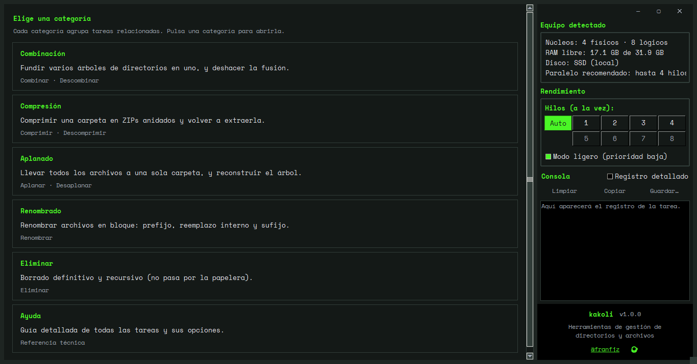
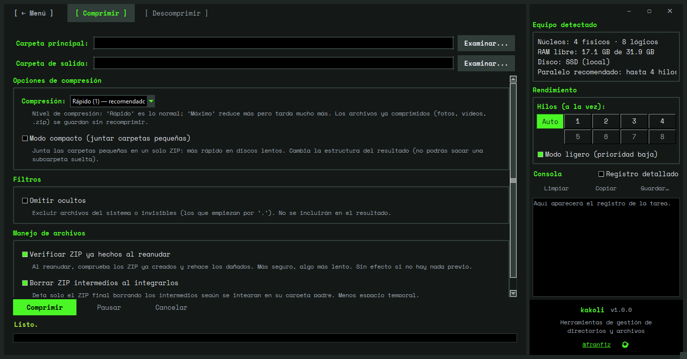
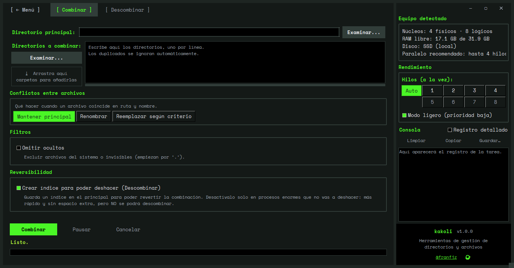
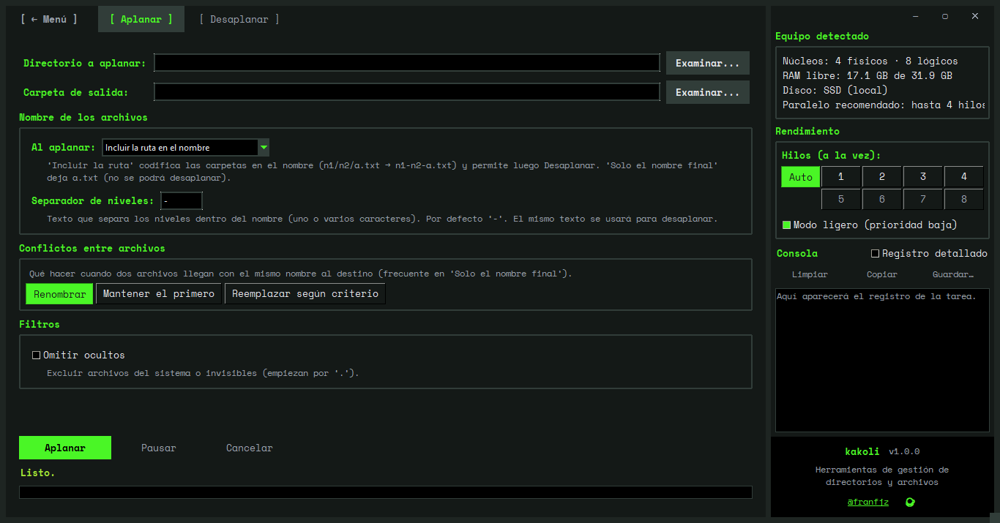
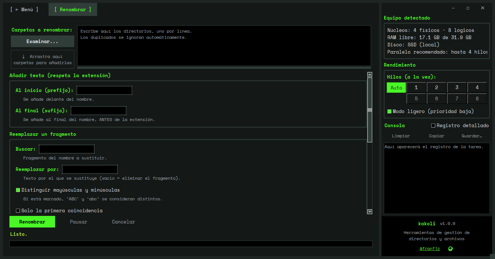
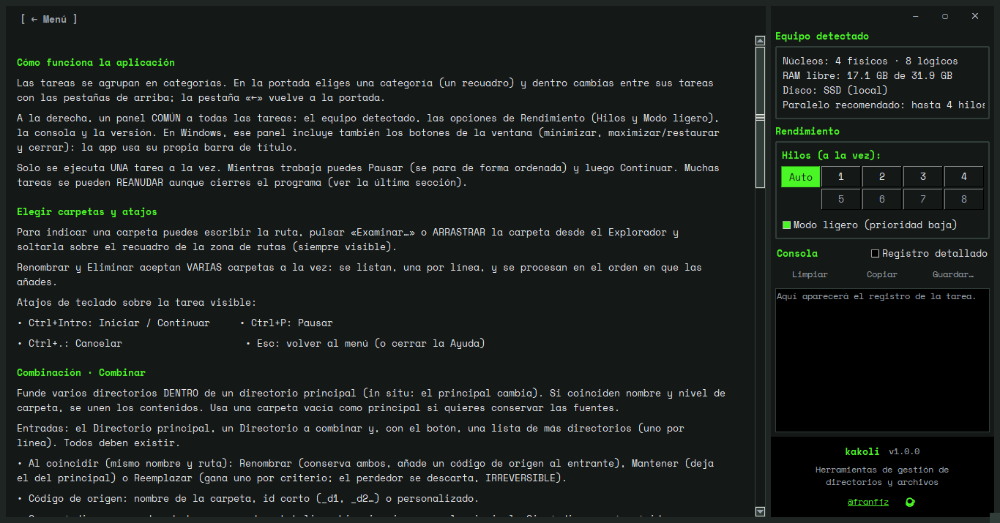

# kakoli

> **Herramientas de gestión de directorios y archivos**: comprimir, combinar, aplanar, renombrar y eliminar carpetas, con una interfaz clara y un motor independiente por tarea.

Aplicación **Python 3.11 + Tkinter**, sin dependencias de terceros. Cada tarea corre en su propio motor (pausable, reanudable y paralelizable según el equipo) y comparte una interfaz de dos niveles con un panel de rendimiento común.

<p align="center">
  
</p>

---

## ✨ Características

La app agrupa las tareas en **categorías**; cada categoría reúne tareas relacionadas (a menudo una y su inversa):

| Categoría | Tareas | Qué hace |
|---|---|---|
| **Combinación** | Combinar · Descombinar | Funde varios árboles de directorios en un principal (in situ) con un **índice JSON** que permite deshacer la fusión. |
| **Compresión** | Comprimir · Descomprimir | Comprime una carpeta en **ZIPs anidados** (un `.zip` por subcarpeta) y la vuelve a extraer. |
| **Aplanado** | Aplanar · Desaplanar | Lleva todos los archivos a una sola carpeta (opcionalmente codificando la ruta en el nombre) y **reconstruye** el árbol. |
| **Renombrado** | Renombrar | Renombra archivos en bloque —prefijo, reemplazo interno y sufijo— **sin tocar la extensión**, con vista previa. |
| **Eliminar** | Eliminar | Borrado **definitivo** y recursivo (no pasa por la papelera), con modo simular. |

Además, una pestaña **Ayuda** integrada documenta cada tarea y sus opciones.

**Transversal a todas las tareas:**

- 🧠 **Automático por defecto** — detecta el equipo (núcleos, RAM, tipo de disco, carga) y elige el número de hilos; se puede fijar a mano.
- ⏸️ **Pausar / Continuar** de forma ordenada, y **reanudar tras cerrar el programa** (Comprimir, Aplanar y Desaplanar guardan su progreso en un JSON; el resto reanuda por el propio destino). Al reanudar, una **caché del árbol** evita volver a recorrer el disco.
- 🖱️ **Arrastrar y soltar** carpetas desde el Explorador; **Renombrar y Eliminar** aceptan **varias carpetas** a la vez (en orden).
- ⌨️ **Atajos de teclado**: `Ctrl+Intro` iniciar/continuar · `Ctrl+P` pausar · `Ctrl+.` cancelar · `Esc` volver al menú.
- 🪶 **Modo ligero** (prioridad baja) para seguir usando el equipo mientras trabaja.
- 🪟 **Barra de título propia** (Windows): controles de ventana integrados en el panel, con soporte HiDPI nítido.
- 🔒 **Seguro**: escritura atómica (temporal + reemplazo), anti *path‑traversal*, y avisos claros antes de acciones irreversibles.
- 🖥️ **Sin dependencias**: solo la biblioteca estándar de Python (Tkinter).

---

## 📸 Capturas

| Comprimir | Combinar |
|---|---|
|  |  |

| Aplanar | Renombrar |
|---|---|
|  |  |

<p align="center">
  
</p>

---

## 🚀 Uso (desde el código)

Requiere **Python 3.11+** (con Tkinter, incluido en la instalación estándar de Python en Windows y macOS; en Linux, `sudo apt install python3-tk`).

```bash
python kakoli.py
```

Cada motor es además una **CLI** independiente:

```bash
python -m tasks.comprimir.motor CARPETA
python -m tasks.descomprimir.motor ARCHIVO.zip
python -m tasks.eliminar.motor CARPETA
```

> Las fuentes **Space Mono** (en `fuentes/`) se registran automáticamente al arrancar; si no están, la app usa una fuente monoespaciada del sistema (Consolas).

---

## 📦 Ejecutables y releases (Windows + Linux)

kakoli se compila a un **ejecutable nativo con [Nuitka](https://nuitka.net/)** (Python → C), sin necesidad de Python en la máquina destino, para **Windows x64** y **Linux x64**. La lógica de build y empaquetado está centralizada en [`build.py`](build.py) (fuente única, compartida por el CI y el build local).

**Release automático:** un tag de versión dispara el workflow [`.github/workflows/release.yml`](.github/workflows/release.yml), que compila en paralelo en Windows y Linux y publica **un solo GitHub Release** con ambos paquetes:

```bash
git tag v1.8.0-alpha
git push origin v1.8.0-alpha
```
```text
kakoli-1.8.0-alpha-windows-x64.zip
kakoli-1.8.0-alpha-linux-x64.tar.gz
```

**Build local (Windows)** — requiere Microsoft C++ Build Tools:
```powershell
./.venv/Scripts/python.exe -m pip install nuitka tkinterdnd2
.\build_nuitka.ps1 -Limpiar        # deja el .zip en dist\
```

**Build local (Linux)**:
```bash
sudo apt-get install -y python3-tk tk-dev patchelf
python -m pip install nuitka tkinterdnd2
python build.py                    # deja el .tar.gz en dist/
```

La app también corre en Linux **directamente desde el código** (`python kakoli.py`, con `python3-tk`): las piezas de Windows (barra de título propia, DPI, icono `.ico`) degradan solas. Más detalles en [`BUILD_NUITKA.md`](BUILD_NUITKA.md).

> El icono `iconos/kakoli.ico` (multi‑resolución, 16→256) se genera del arte en `iconos/` con Pillow. Como es **pixel‑art**, los tamaños grandes (128 y 256) se reescalan con `NEAREST` para no emborronar los píxeles (así se ve nítido en la vista *Iconos grandes/muy grandes* del Explorador); los pequeños con `LANCZOS` para que sean legibles:
> ```python
> import io, struct
> from PIL import Image
> maestro = Image.open("iconos/icono_piramide_jungla_1024.png").convert("RGBA")
> PLAN = {256: Image.NEAREST, 128: Image.NEAREST, 64: Image.LANCZOS,
>         48: Image.LANCZOS, 32: Image.LANCZOS, 24: Image.LANCZOS, 16: Image.LANCZOS}
> items = sorted((sz, maestro.resize((sz, sz), m)) for sz, m in PLAN.items())
> blobs = [(_sz, (lambda b: (im.save(b, "png"), b.getvalue())[1])(io.BytesIO()))
>          for _sz, im in items]
> with open("iconos/kakoli.ico", "wb") as fh:
>     fh.write(struct.pack("<HHH", 0, 1, len(items)))
>     off = 6 + len(items) * 16
>     for (sz, _b), (_sz, blob) in zip(items, blobs):
>         w = 0 if sz >= 256 else sz
>         fh.write(struct.pack("<BBBBHHII", w, w, 0, 0, 0, 32, len(blob), off)); off += len(blob)
>     for _sz, blob in blobs:
>         fh.write(blob)
> ```

---

## 🗂️ Estructura del proyecto

El código está organizado en **paquetes por responsabilidad** — **`core/`** (núcleo
estable, sin Tkinter), **`gui/`** (estructura general de la interfaz) y **`tasks/`**
(una carpeta por tarea) — con `kakoli.py` como raíz de composición.

```
kakoli/
├─ kakoli.py               # Raíz de composición: arma App con el REGISTRO y arranca
├─ bench.py                # Banco de pruebas + round-trip (correctness) + métricas
├─ build_nuitka.ps1        # Build con Nuitka (onefile .exe: fuentes + iconos + LTO)
│
├─ core/                   # Núcleo estable, agnóstico de dominio y de la GUI (stdlib, sin Tk)
│  ├─ resultado.py         #   Resultado, EstadoResultado, Cancelado
│  ├─ opciones.py          #   OpcionesBase (detallado/politica + recorrido de FS)
│  ├─ formato.py           #   humano/duracion/ahora + PASO_REGISTRO
│  ├─ cli.py               #   correr_cli, Interrupcion, preguntar_consola
│  ├─ reanudable.py        #   RegistroReanudable: progreso reanudable (JSONL) común
│  ├─ cache_arbol.py       #   CacheArbol: caché del árbol explorado (evita re-explorar)
│  ├─ json_util.py         #   guardar_json/cargar_json: JSON atómico común
│  ├─ control.py           #   Control: parada común (pausa/cancelar/PAUSA/límite)
│  ├─ recursos/            #   Equipo (subpaquete): sondas (mide) + politica (decide hilos)
│  ├─ paralelo.py          #   Orquestación de la ejecución paralela (Ejecutor, planes)
│  ├─ registro.py          #   Categoria, DescriptorTarea, Registro (contrato de tarea)
│  └─ ejecucion.py         #   Máquina hilo+cola de una tarea (sin Tk)
│
├─ gui/                    # Estructura general de la interfaz (no conoce las tareas)
│  ├─ tema.py · campo.py · constantes.py · ayuda.py · componentes.py · contexto.py
│  ├─ dnd.py · marco_ventana.py    #   arrastrar y soltar · barra de título propia (Windows)
│  ├─ pestana_base.py          #   base común de todas las pestañas
│  └─ app.py                   #   la ventana principal (App), construida con el REGISTRO
│
├─ tasks/                  # Una carpeta por tarea + el manifiesto + formatos compartidos
│  ├─ __init__.py              #   REGISTRO (categorías → tareas): fuente de verdad para escalar
│  ├─ formatos/                #   formato_zip · indice_combinacion · nombres_aplanado
│  ├─ comprimir/  · descomprimir/     #   cada tarea: motor.py · pestana.py · ayuda.py · __init__ (DESCRIPTOR)
│  ├─ combinar/   · descombinar/
│  ├─ aplanar/    · desaplanar/
│  ├─ renombrar/  · eliminar/
│
├─ fuentes/                # Space Mono (.ttf) + licencia OFL
├─ iconos/                 # Arte de la app (.png) + kakoli.ico
├─ tests/                  # Suite (core/ · gui/ · tasks/ · guardián de fronteras)
├─ docs/                   # Documentación técnica viva (ARQUITECTURA.md)
└─ docs_old/               # Documentación histórica (fases de diseño, roadmaps)
```

Cadena de dependencias (sin ciclos): `core ← gui ← tasks ← kakoli`. Cada tarea es un
paquete vertical y autónomo; añadir una es crear su carpeta y una línea en
`tasks/__init__.py`, sin tocar `core/` ni `gui/`.

---

## 📚 Documentación

- [`docs/ARQUITECTURA.md`](docs/ARQUITECTURA.md) — visión completa del sistema (módulos, contrato de motores, arquitectura de rendimiento, invariantes). **Documento vivo.**
- [`docs_old/`](docs_old/) — documentación **histórica** (`REESTRUCTURACION.md`, `GUI.md`, `escalabilidad.md`, `roadmap_*.md`): describe fases de diseño o la estructura anterior.

---

## 🧪 Pruebas y rendimiento

La suite se ejecuta con **pytest** (dependencia solo de desarrollo, en `requirements-dev.txt`):

```bash
./.venv/Scripts/python.exe -m pytest -q
```

`bench.py` genera árboles sintéticos y comprueba **round‑trip byte a byte** (que reconstruir lo transformado da lo original), además de medir tiempos:

```bash
python bench.py --todos                 # round-trip de compresión (todos los escenarios)
python bench.py --merge --todos         # combinar → descombinar
python bench.py --flatten --todos       # aplanar → desaplanar
python bench.py --reanudar --todos      # pausar a la mitad, "cerrar" y reanudar
```

---

## 📄 Licencia y créditos

- **Fuentes**: [Space Mono](fuentes/) bajo la SIL Open Font License (ver `fuentes/OFL.txt`).
- **Autor**: [@franfjz](https://github.com/franfjz).

> Los enlaces del pie de la app (autor y "invítame a un café") se configuran en `gui/constantes.py` (`URL_AUTOR`, `URL_CAFE`).
